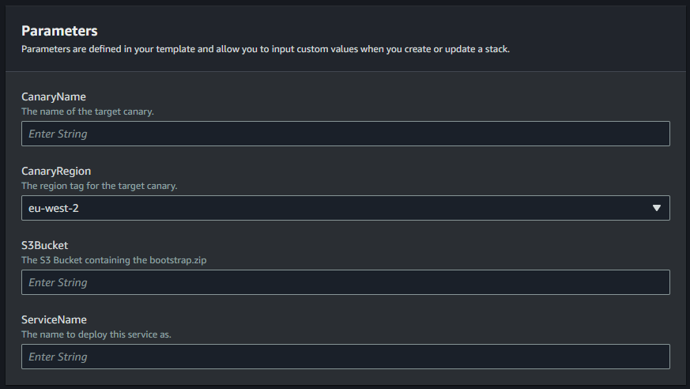

# aws synthetic state

This package is used to check the last run status of an AWS CloudWatch Synthetic Canary, and will return an error if the last run was unsuccessful. The function is designed to be used in conjunction with API Gateway, and the Platform Status dashboard.

Platform Status tracks graphs via an API call, and in order to complete the graph, it must receive a specified response code. By returning `Ok` or `Error`, API Gateway will return either a successful code or a failure code.

## Usage

Provide the canary name and region as lambda environment variables:

| Variable Name | Type   |
|---------------|--------|
| canaryName    | String |
| canaryRegion  | String |  

## Output

| Canary State   | Output Response |
|----------------|-----------------|
| Run Successful | 200 (Ok)        |
| Run Failure    | 404 (Error)     |

---

## Deployment

For deployment, a CloudFormation stack is provided in [formation.yml](https://https://github.com/andybzn/aws-synthetic-state/blob/main/formation.yml), which will provide the necessary infrastructure and roles.

### Deploying the Stack

#### Prerequesites

1. You __must__ have created an S3 Bucket in the AWS Region in which you wish to deploy the stack.
1. You __must__ have uploaded the bootstrap.zip to the aforementioned S3 Bucket.

#### Deployment Process

To deploy the CloudFormation stack, load the `formation.yml` file, and provide the following parameters:



Once the parameters have been entered, the stack can be deployed as is, or modified as desired.

## Additional Information

### Roles & Credentials

- For local usage, this package will assume the role specified in `~/.aws/credentials`.
- When running as a lambda function, this package will assume the role granted to the function.

#### AWS IAM Role

If you are manually deploying this function, the Lambda will require a role with the following relationship, coupled with the policy detailed below

```json
{
    "Version": "2012-10-17",
    "Statement": [
        {
            "Effect": "Allow",
            "Principal": {
                "Service": "lambda.amazonaws.com"
            },
            "Action": "sts:AssumeRole"
        }
    ]
}
```

##### Policy

This function requires an access policy with `synthetics:Describe*`, in addition to the [AWSLambdaBasicExecutionRole](https://docs.aws.amazon.com/lambda/latest/dg/lambda-intro-execution-role.html)

```json
{
    "Version": "2012-10-17",
    "Statement": [
        {
            "Effect": "Allow",
            "Action": "synthetics:Describe*",
            "Resource": "*"
        }
    ]
}
```
